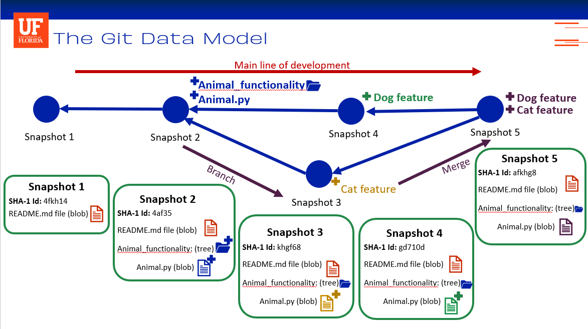
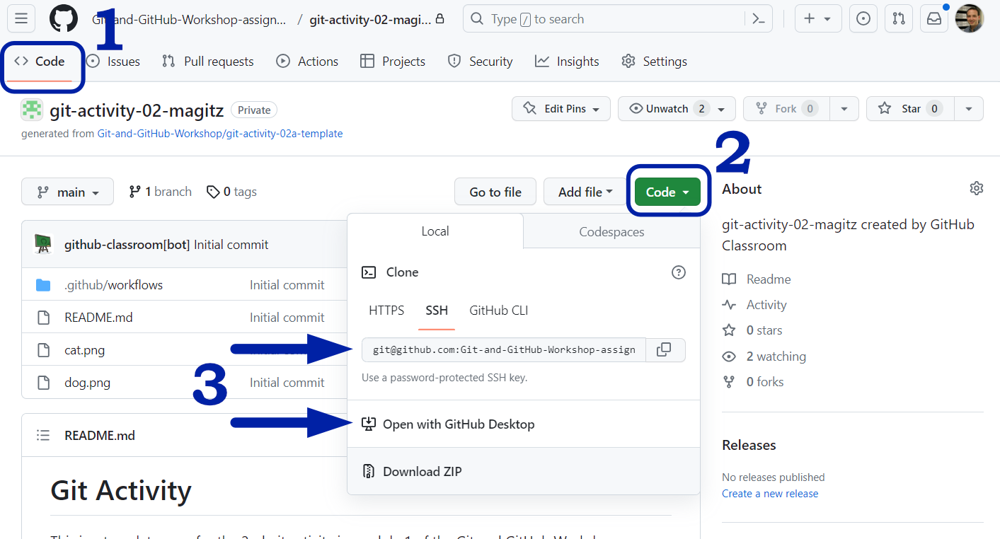

# Git Activity

Welcome to the repository for the second Git activity in Module 1 of the Git and GitHub Workshop. When you accepted the assignment, GitHub forked the template repository and made your copy here to work with.

The repository accompanies Quiz 2 in Canvas. The quiz will ask you questions about the repository, which you can only answer by following the directions within the quiz using this repository.

This activity will also mirror, in some ways, the slides from Dr. Silva's video recording. In that recording, she explored the idea of snapshots using an example pictured below.

Remember, this repo started with a `README.md` file--maybe this very file you are reading now!

Then, a folder called "`Animal_functionality`" and a Python script, "`Animal.py`", were added. Since we don't want to work with Python code in this exercise, we are changing things up a bit, and the new file will be a Markdown file called "`Animal.md`."

Also, note that the commit history and the resulting snapshots will differ from the simplified example in the video.

## Instructions

You should already have the Canvas quiz accompanying this exercise opened; if not, open it now.

1. The first step was using GitHub Classroom to accept this assignment. **Done!**
1. Now, clone this onto your computer to complete the quiz.
   * Click on the green "<>Code" button, and **either** copy the text string to clone the repo (using the command line) **or** click the "Open with GitHub Desktop" button (to have GitHub Desktop clone the repo locally and open it)
   
1. The rest of the instructions are in the Canvas quiz. Follow the directions and answer the questions as you go.
